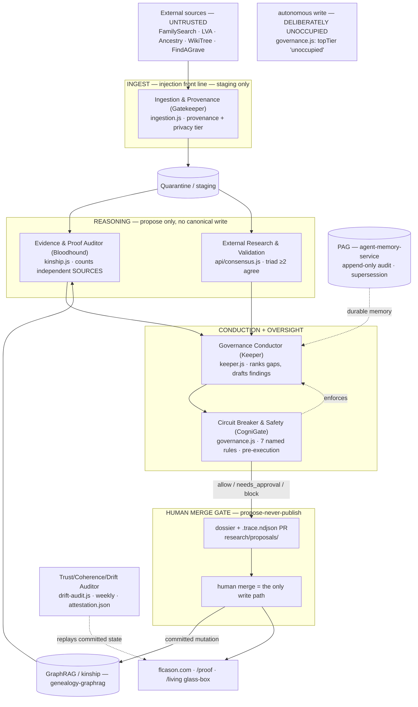

# Vorion-Governed Genealogy — Hardened Architecture & Public-Claim Ledger

*The reconciliation layer for flcason.com: it takes the proposed Vorion governance
vocabulary (BASIS · CogniGate · CAR ID · Paramesphere · PAG), grounds every claim in the
code that actually runs across the four repositories, closes five adversarial gaps using
the machinery that already exists, and re-grades what may be said in public. **No code
changes — this is a sign-off artifact.** The six decisions in §11 are now **resolved**
(recorded there with their rationale); build proceeds against them.*

This sits **above** the existing canon and does not replace it. Read first:
[`ORCHESTRATION.md`](./ORCHESTRATION.md) (the federation register), [`KEEPER.md`](./KEEPER.md)
(the conductor), [`bloodhound.md`](./bloodhound.md) (the one law), [`DRIFT.md`](./DRIFT.md)
(the self-audit). This document adds the one thing those don't: a bridge from the
Vorion-branded concepts to the live mechanisms, and an honest public-claim ledger.

---

## 0. The finding that reframes the brief

The brief reads as a greenfield design. **It is not greenfield.** Surveying the four
repositories on `claude/flcason-agent-orchestration-9adb4y`:

- **cason-heritage** runs a live 13-agent roster (`ui_kits/living-line/agents.js`,
  selftest-enforced), a typed pre-execution gate (`governance.js`, seven named rules),
  NDJSON traces, a `/proof` evidence-tier surface, a `/living` glass-box governance view,
  a weekly **drift-audit** (`scripts/drift-audit.js`) that emits a content-addressed
  `research/attestation.json`, a supersession ledger, and a **Keeper** (`scripts/keeper.js`)
  that runs propose-never-publish on a Monday cron.
- **governed-agents** is the canonical gate + NDJSON trace, and *already* runs a
  multi-model triad (Claude + Gemini + Grok) with a `require-model-consensus` rule.
- **agent-memory-service** is an append-only episodic + audit store with
  supersession-not-deletion — ~75% of a provenance substrate.
- **genealogy-graphrag** is a working hybrid retriever with kinship-graph resolution and
  citations (relational recall 0 → 1.0).

**None of `CAR ID / BASIS / CogniGate / Paramesphere / PAG / ATD` appear in any
repository.** The *substance* of the governance plane is built; the *branded vocabulary*
is not. So the highest-value hardening is not to build new components — it is to (a) map
the vocabulary onto the live mechanisms without renaming working code to sound novel, and
(b) re-grade the public claims accordingly. The brief's own truth-in-claims instinct (B5)
demands exactly this.

---

## 1. The reconciliation — Vorion vocabulary ↔ what already runs

This table is the centre of the document. Every proposed concept is bound to the live
mechanism that instantiates it, the file that proves it, and a recommendation.

| Vorion concept | Live mechanism (today) | Proof (repo · file) | Status | Recommendation |
|---|---|---|---|---|
| **CogniGate** (cross-tier enforcement) | `evaluatePolicy(action, rules)` → `allow / needs_approval / block` | governed-agents `lib/governance.ts`; cason-heritage `ui_kits/living-line/governance.js` (faithful port) | **Built** | Adopt "CogniGate" as the *cross-system label* for this gate. Do **not** rebuild. |
| **CAR ID** (scoped agent identity) | `agents.js` registry — each agent has a handle, modules, abilities, autonomy tier, governance hooks; `selftest:agents` enforces "a `live` agent must have a real module on disk" | cason-heritage `ui_kits/living-line/agents.js` | **Built (unsigned)** | The registry *is* CAR ID. Net-new = cryptographically signing the entry (identity → capability binding becomes tamper-evident). |
| **ATD** (Agent Trust Descriptor) | The `agents.js` registry entry itself: identity bound to autonomy tier + capability envelope + governance hooks | same as above | **Built (unsigned)** | ATD = a signed `agents.js` entry. Don't invent a new artifact; sign the one that exists. |
| **BASIS tiers** (T1–T7) | Autonomy tiers `advises / proposes / acts-bounded / cross-cutting`, with the **top tier (autonomous write) deliberately unoccupied** (`governance.js` `supervised()` → `topTier: 'unoccupied'`) | cason-heritage `agents.js`, `governance.js` | **Built (different scale)** | **Resolved (§11-3):** BASIS = a **privilege + assurance ladder** (§4). Tier = max write privilege (gate-checkable); each rung carries assurance requirements. The empty top *is* the frontier — and under privilege semantics it is two rungs deep (§4). |
| **PAG** (provenance, replayable) | Append-only episodic + audit log + supersession-not-deletion (`agent-memory-service`); content-addressed `attestation.json` digest (cason drift-audit); per-run `.trace.ndjson` (Keeper) | agent-memory-service `src/agent_memory/`; cason `research/attestation.json`, `research/proposals/*.trace.ndjson` | **~75% built** | PAG = agent-memory-service + the trace + the attestation digest. Net-new = content-addressing on memory writes, signing, agent-identity on audit entries, replay snapshot (§7-5). |
| **Paramesphere** (model-identity attestation) | `attestation.json` = content-addressed digest + **per-persona behavioral fingerprints**, regression-checked weekly by drift-audit. **And a weight-space target already exists:** genealogy-graphrag loads `sentence-transformers/all-MiniLM-L6-v2` + `cross-encoder/ms-marco-MiniLM-L-6-v2` locally (full weight custody), and agent-memory-service embeds locally — load-bearing open weights, currently unfingerprinted | cason `scripts/drift-audit.js`, `research/attestation.json`; genealogy-graphrag `src/genealogy_rag/config.py`, `embeddings.py`, `rerank.py` | **Behavioral built; weight-space target present, unfingerprinted** | **Resolved (§11-6):** full self-host ladder S0→S3 (§10). S0 fingerprints the embedder/reranker weights *now* (a tampered embedder silently corrupts retrieval — a real attack surface); S2/S3 add LLM-grade targets. |
| **Red Cell / oversight independence** | The **one law**: corroboration counts independent *sources*, not voices (`bloodhound.md`); `require-model-consensus` (≥2 of the triad) | cason `research/bloodhound.md`, `governance.js`; governed-agents `lib/consensus.ts` | **Built (source-level)** | **Resolved (§11-4):** Bloodhound (structural filter) **and** an attested adversarial **Red-Cell mode** (generative disconfirmation hunter) — complementary, not substitutes. Net-new = the mode + *attesting* the consenting/adversarial instances are distinct (§7-2). |

**The headline recommendation:** treat the Vorion terms as a **standard vocabulary layered
over working mechanisms**, never as a mandate to re-implement them under new names. That is
the only framing that survives B5.

---

## 2. Adversarial read — carried forward, plus what the survey changes

The brief's B1–B5 stand and are well-aimed; keep them verbatim. The survey adds three:

- **B6 — do not rebuild under new names.** The largest risk now is *vocabulary churn*:
  re-implementing `governance.js`/`agents.js`/`drift-audit.js` as "CogniGate"/"CAR ID"/"PAG"
  modules to match the brief. That destroys working, self-tested code and manufactures the
  exact gap between marketing and reality the system exists to refuse. Map, don't rename.
- **B7 — adopt the live roster, not the hypothetical one.** The brief's roster
  (Scout/Scribe/Correlator/Adjudicator/Publisher) does not exist; the live roster
  (Keeper/Bloodhound/Personas/Ingestion-Gatekeeper/Curator/Almanac/…) does, and is
  selftest-enforced. Demo copy and diagrams must use the live names or they describe
  fiction.
- **B8 — the GPS framing is absent in the code.** The brief leans on the Genealogical
  Proof Standard (esp. "GPS component 4"); the live system uses its **own** evidence tiers
  (`confirmed / secondary / leading / possible / unsolved / eliminated / disproven`) and the
  bloodhound law, and never references GPS. **Resolved (§11-2): map-and-grade.** Each GPS
  component maps to a live mechanism (GPS-2 citations → provenance/`/proof`; GPS-3/4
  analysis + conflict resolution → bloodhound law + `no-overclaimed-record`; GPS-5 written
  conclusion → the dossier) and is graded **per component, never wholesale** — with the
  GPS-1 caveat stated plainly: the Keeper sweeps a *bounded* source set, so GPS-1
  ("reasonably exhaustive research") is claimed as **coverage, not completeness**, and the
  swept sources are reported. The tiers + law remain the operational layer; refusals are
  expressed in their terms (§6).

---

## 3. Reconciled control structure (live agents, real gate)

Privacy is **not** a separate agent — it is the Gatekeeper's privacy tier plus the
persona temporal-horizon circuit breaker and the `/living` living-private exclusion. The
unoccupied top tier is the autonomy frontier the governance telemetry would one day
justify moving — the empty slot is the pitch, not a gap.

---

## 4. Trust & attestation model (grounded)

**BASIS, canonically (resolved §11-3): a privilege + assurance ladder.** A tier is the
**maximum write privilege** an agent may hold — the thing CogniGate can check mechanically —
and each rung carries **minimum assurance requirements** to hold it (what the auditor
checks). Autonomy and pipeline-stage are not separate axes; both fall out of privilege.
Two structural rules:

- **T5 is deliberately non-nested.** The ladder nests T1–T4 and T6–T7, but oversight
  privilege is a *branch*, not a superset — **separation of duties**: an agent may not hold
  T4 (propose) and T5 (verdict) in the same claim domain, or it can launder its own claims.
  The live code already obeys this (`drift-audit.js`: *"it does not touch data.js"*).
- **The top two rungs are where the humans live.** The brief claimed T7 unoccupied; under
  privilege semantics the truth is stronger — autonomous agents top out at **T5**; T6
  exists only as the human-agent dyad (the merge); T7 is reserved.

| Tier | Privilege (gate-checkable) | Assurance required to hold it | Who holds it today |
|---|---|---|---|
| T1 | Read + advise only (no writes) | CAR ID (registry entry) | Almanac, Journey, Reflection, Personas¹ |
| T2 | Staging/quarantine write | + provenance rules enforced on every write | Ingestion/Gatekeeper |
| T3 | Annotate/cite staged items | + current behavioral attestation | *(unoccupied — citation lives inside the Gatekeeper)* |
| T4 | Propose against canonical; drafts | + corroboration law (sources, not voices) | Bloodhound, Consensus, Curator, Keeper |
| T5 | Oversight verdicts (gates others) | + **distinct-instance attestation** vs. whatever it oversees; **no T4 in the same domain** | Drift Auditor; Red-Cell mode (§7-2) |
| T6 | Canonical/public write **with human co-sign** | + full PAG record + recorded human signature | **No agent — the human merge itself** |
| **T7** | Canonical/public write, no human | + all of the above + quantified telemetry thresholds (defined, unmet) | **Unoccupied — reserved** |

¹ The personas' temporal-horizon is a *runtime bound*, not a write privilege — T1 with
extra runtime constraints. Tiers may be honestly unoccupied at the low end too (T3).
CogniGate (`governance.js`) is not an agent holding a tier; it is the enforcement plane.
This ladder is the industrializable form: the assurance column *is* the conformance
checklist a future "BASIS 1.0" would version.

**The five-layer per-action check, reconciled:**

1. **CAR ID** — the acting agent resolves to an `agents.js` registry entry. *Built; sign it
   to make it tamper-evident.*
2. **ATD** — that entry's capability envelope (modules, abilities, autonomy tier). CogniGate
   checks the action falls inside it. *Built; the signed entry is the ATD.*
3. **BASIS tier** — the action's required privilege ∈ the agent's envelope (T1–T4, T6–T7
   nest; T5 checked as the non-nested oversight branch). *Provable within-system* (your
   standard, your system); "industry standard" stays aspirational until BASIS 1.0 +
   external adoption.
4. **Model-identity attestation — dual mode, two grades:**
   - *Behavioral (today, all agents):* `attestation.json` content-addressed digest +
     per-persona fingerprints, regression-checked weekly. Detects gross drift/swap on
     fingerprinted behaviors. **Strictly weaker than weight identity; for API agents you are
     ultimately trusting the provider's model routing — name that assumption (B-canary).**
   - *Weight-space (S0 — applicable today):* the system already runs open weights with full
     custody — graphrag's MiniLM embedder + ms-marco reranker, memory-service's embedder.
     S0 pins HF revision + artifact SHA-256 at build and computes a **loaded-state**
     fingerprint at model load, landing both in `attestation.json`. **Honesty note — what
     `I(θ)` adds over a file hash:** for at-rest files, `sha256(safetensors)` is stronger
     and cheaper; a weight-space fingerprint earns its keep in exactly two places — (a)
     attesting the *loaded, in-memory* state (catches post-load tampering a file hash never
     sees), and (b) identity that *survives benign re-serialization* (re-saved/re-sharded
     weights: hash alarms falsely, fingerprint correctly says "same model"). Any demo must
     show one of those two, or it is a file hash with extra steps. Qualified throughout:
     same-model tamper/swap on a fixed weight set — **not** cross-model identity, **not**
     quantization-robust.
5. **PAG** — the admitted action is recorded append-only with inputs, attestation result,
   tier, and reasoning, replayable. *agent-memory-service + the NDJSON trace + the
   attestation digest; net-new crypto in §7-5.*

---

## 5. Hazard analysis (STPA) mapped to the **real** gate

Losses unchanged: L1 false conclusion published · L2 living-person privacy breach · L3
corrupted canonical record · L4 credibility loss · L5 governance bypass discredits the
demo. Hazards now map to the seven rules that actually run in `governance.js`:

| ID | Hazard | Live constraint that controls it (real rule) |
|---|---|---|
| H1 | Living-person PII surfaced | Gatekeeper privacy tier + persona temporal-horizon breaker + `/living` living-private exclusion |
| H2 | Claim promoted above its evidence | `no-overclaimed-record` — cannot assert `confirmed`/`secondary` without a primary doc ≥ threshold; tier caps otherwise |
| H3 | Disproven myth re-asserted | `no-quarantined-myth` — blocks any action repeating a quarantined claim |
| H3′ | Ruled-out ancestor revived | `no-eliminated-kin` — blocks reviving an `eliminated` kin line |
| H3″ | Correction silently reverted | `no-superseded-value` — blocks contradicting the supersession ledger |
| H4 | Silent model swap / echo | `require-model-consensus` (≥2 *independent sources*, per bloodhound) + weekly drift attestation |
| H5 | Injection via untrusted source | Ingest is data, not instructions; Gatekeeper staging-only write — injection cannot reach canonical |
| H6 | Unprovenanced claim | `require-provenance` — blocks any action citing no source |
| **H7** | **Post-commit drift** — a *standing* canonical assertion no longer supported by replayed evidence (retracted source, broken citation, later-weakened merge, agent later found compromised) | **Net-new invariant on existing machinery:** add to `drift-audit.js`'s invariant battery a check that replays PAG provenance for each standing claim against current evidence and opens a drift PR on divergence |

H7 is the only genuinely missing hazard, and its control is an *extension* of a system
that already runs weekly — not a new subsystem.

---

## 6. The money shot — Cason ↔ Causey, refused without DNA

Re-expressed through the **live gate and the bloodhound law**. Per the sign-off decision,
**no Y-DNA**: the refusal stands on evidence corroboration alone, so it is correct
regardless of any haplogroup contest.

1. **Ingestion/Gatekeeper** lands a Dorchester County, MD record naming a *John Causey*,
   c. 1670, in **quarantine** with provenance (staging-only write — H5 contained).
2. **Bloodhound (Evidence & Proof Auditor)** weighs a proposed merge of the Causey cluster
   into the Cason paternal line. The case for it is phonetic adjacency (Cason/Casson ↔
   Causey/Cossey) plus an overlapping VA→MD migration window — **one weak indirect strand**,
   not independent corroboration.
3. **External Research / consensus** returns three models "agreeing" the merge is
   plausible. **The one law fires:** three voices tracing to the same derivative trees are
   *one* source echoed thrice, not three confirmations — exactly the Thomas-1608-Digswell
   echo `bloodhound.md` already documents. `require-model-consensus` is satisfied on *count*
   but the source-independence test collapses the echo to a single weak strand.
4. **CogniGate (`governance.js`)** evaluates the merge action:
   - `no-overclaimed-record` → the merge would assert a `confirmed` paternal link on
     indirect evidence with no primary record → **caps the tier at `possible`** (a primary
     record outweighs any number of derivative trees — the corollary law).
   - `lead-needs-human-merge` → routes the (capped) finding to the human merge gate.
   - Decision: **not `allow`.** The canonical record is never mutated autonomously.
5. **Outcome:** the canonical line is uncorrupted. The Keeper writes a dossier +
   `.trace.ndjson` to `research/proposals/`; a human reviews. `/proof` can publish a
   "Cason vs. Causey" disambiguation marked **[possible as separate lines] / [unproven as
   merge]**, evidence cited. `/living` is unaffected (privacy untouched).

One vignette exercises CAR-ID-scoped agents, the live gate, the bloodhound independence
law, propose-never-publish human gating, and a replayable trace — and gets the genealogy
*right on evidence alone*. If a verified Y-DNA exclusion later exists, it becomes a
*strengthening* footnote, never the load-bearing beam.

---

## 7. The five hardening gaps — grounded (gap → live cover → net-new delta)

1. **Money-shot must be DNA-robust.** *Live cover:* the bloodhound law + `no-overclaimed-record`
   already refuse the merge on evidence. *Delta:* none — adopt §6 as the acceptance trace;
   drop the Haplo agent and the `ydna_haplogroup_conflict` gate from the brief (no such agent
   or rule exists, and DNA is out by decision). H3-as-DNA becomes H2/H3″ as written.
2. **Enforced oversight independence.** *Live cover:* bloodhound counts independent sources;
   `require-model-consensus` needs ≥2. *Delta (resolved §11-4), two parts:* (a) CogniGate
   refuses to honor a consensus when model-identity attestation shows the consenting agents
   resolved to the **same model instance** — bind the §4 fingerprints to the consensus check
   so "independent" is *attested*, not assumed. (b) Add an attested **Red-Cell mode** to the
   External-Research/consensus agent — Bloodhound is a *structural filter* (echo-collapse,
   overclaim caps) but never *hunts disconfirmation*; the Red-Cell mode is generative-
   adversarial ("find the record that proves these are two people; make the strongest case
   against this merge"), runs on a provably distinct instance, holds T5 in the claim domains
   it attacks (so never T4 there), and its verdict is refused if attestation shows it
   collapsed onto the generator's instance. A *mode*, not a 14th agent — privacy-style:
   don't proliferate agents for what is a constraint.
3. **Canary / provider trust, named.** *Live cover:* weekly drift attestation. *Delta:*
   make the fingerprint/probe set **secret + rotated**, add distributional drift on real
   outputs (not only fixed challenges), and **state plainly in the ledger that for API
   agents the provider's model routing is a trust assumption, not a proof** — you cannot
   out-attest the provider.
4. **Post-commit drift (H7).** *Live cover:* `drift-audit.js` already runs weekly with an
   invariant battery + attestation + regression PR. *Delta:* add one invariant — replay PAG
   provenance for each standing claim vs. current evidence; open a drift PR on divergence.
   This *is* the reconciliation auditor (primitive #1).
5. **PAG substrate, pinned — with a firewall.** *Live cover:* agent-memory-service
   (append-only episodic + audit + supersession) + cason's content-addressed
   `attestation.json`. *Resolved (§11-5):* agent-memory-service **hosts** PAG, but PAG is
   **only its append-only slice** (episodic + audit — already write-once, never-deleted),
   fire-walled from the layer that *forgets*: semantic consolidation mutates in place and
   TTL prunes — by design, and the **opposite** of a provenance ledger, which must never
   forget and must be tamper-evident. The mutable/forgetting layer stays "memory" and is
   explicitly **not** the provenance of record. *Delta (= the definition of "done"):*
   content-address PAG writes (SHA-256 over content+metadata), sign entries, record
   `agent_id` + `model_id` + `attestation_level`, persist a replay snapshot. "PAG" expands
   as Provenance Attestation **Graph** (items already carry upstream-ID provenance edges —
   it *is* a DAG); the "gateway" is just its write interface. Until the deltas land,
   **"replayable provenance" is qualified, not provable** in the ledger.

---

## 8. The three primitives → where they land in the live system

| Primitive (proven in `governed-trader`) | Lands as | Live module to extend |
|---|---|---|
| Reconciliation drift auditor | H7 standing-claim invariant | `scripts/drift-audit.js` (DRIFT.md) |
| Human-approval glass-box | the held-action view with the full attestation stack | `/living` glass-box + `lead-needs-human-merge` + Keeper PR |
| Attested multi-model consensus | fingerprint-attested distinct instances | `api/consensus.js` + `governance.js require-model-consensus` + `bloodhound.md` |

All three already have working seeds; each is an *extension*, not a build.

---

## 9. Public-claim ledger — re-graded against the code

The brief's ledger under-counts what is built. Honest re-grade:

| Claim | Brief said | Re-graded | Basis |
|---|---|---|---|
| CogniGate hard-gates actions | buildable | **Provable / running** | `governance.js` + `keeper.js`, selftested |
| CAR ID = scoped checkable identity | buildable | **Built (unsigned)** | `agents.js` registry + `selftest:agents` |
| Tier-gated capability, self-consistent | provable within-system | **Built** | autonomy tiers + unoccupied top tier in code |
| Multi-model consensus catches swap/echo | qualified | **Built (source-level), qualified on adaptive evasion** | `bloodhound.md`, `consensus.ts`, `require-model-consensus` |
| Replayable provenance (PAG) | implied | **Qualified** until content-addressing/signing/snapshot land | agent-memory-service + attestation.json |
| Behavioral model attestation | (API fallback) | **Built, qualified** | `attestation.json` fingerprints, weekly drift |
| Paramesphere `I(θ)` weight-space | qualified | **Applicable today (S0), qualified** — load-bearing open weights (embedder/reranker) run with full custody, currently unfingerprinted; LLM-grade target arrives with S2/S3 | graphrag `embeddings.py`/`rerank.py`; memory-service embedder; same-model-only + quantization caveats stand |
| BASIS as *industry* standard | aspirational | **Aspirational** | no external adoption |
| "Fully autonomous" | reframe | **Supervised-autonomous** | human merge is the only write path; T7 unoccupied |
| Telemetry could justify removing the human (T7) | aspirational | **Aspirational (roadmap thesis)** | unchanged |

---

## 10. Build staging (federation-seam first — aligns with the live crons/CI)

Most agents exist; the gap is the seam (ORCHESTRATION.md §0). Staging reflects that:

- **Stage 0 — wire the seam.** Point `memory-client.js` at the real agent-memory-service
  (`KEEPER_MEMORY_URL`); point consensus/kinship at the real services instead of in-browser
  ports. *Benchmark:* a Keeper run reads/writes durable memory and one shared trace.
- **Stage 1 — attest independence.** Bind §4 fingerprints to `require-model-consensus`;
  refuse same-instance consensus. *Benchmark:* a forced same-model "consensus" is rejected.
- **Stage 2 — reconciliation invariant (H7).** Add the standing-claim replay check to
  `drift-audit.js`. *Benchmark:* a retracted source trips a drift PR.
- **Stage 3 — PAG crypto.** Content-address + sign memory/audit writes; record agent/model
  identity; persist a replay snapshot. *Benchmark:* a months-later refusal is reconstructable
  byte-for-byte.
- **Stage 4 — public-claim honesty pass.** `/proof` confidence labels never exceed the
  ledger; `/living` privacy enforced; demo copy uses live names (B7) and the ledger's
  grades (§9). *Benchmark:* no public claim outruns §9.

**The self-host ladder (resolved §11-6: full ladder adopted, S0→S3).** Two honest
corrections to the brief's §7 frame it: at current volume (a weekly Keeper cron, hundreds
of images/month) **the cost argument for self-hosting fails** — API and serverless-GPU
costs are both single-digit dollars/month, and cost only flips at ~100× volume (bulk
archive ingestion). The honest driver is **attestation + capability demonstration**. And
"open-weight API" providers (Together/Fireworks/Bedrock-style) are a trap option: open
weights ≠ **weight custody**; no custody → no `I(θ)` → not "self-hosted" for attestation
purposes.

- **S0 — fingerprint the weights already running** (immediate, ~zero cost). Pin HF
  revision + artifact SHA-256; loaded-state fingerprint at model load for graphrag's
  MiniLM embedder + ms-marco reranker and memory-service's embedder; land in
  `attestation.json`; the existing weekly drift-audit regression-checks them for free.
  *Benchmark:* "weight-space attestation in production" is a true sentence, demonstrated on
  the case a file hash cannot cover (§4-4).
- **S1 — CI swap-test harness.** Load a small open model → fingerprint → swap/perturb
  weights → fingerprint trips → quarantine; include the benign re-serialization case
  (hash alarms falsely, fingerprint holds). *Benchmark:* tamper trips; benign re-save
  does not.
- **S2 — production self-hosted Scribe** (batch OCR/extraction). Infra: **Cloud Run GPU**
  (already the memory-service platform; scale-to-zero; L4 ≈ $0.7–1/hr → a 30-min weekly
  batch ≈ $2–5/mo, structural estimate; weight volume cached to tame cold pulls). Model
  candidates: Qwen-VL-class document VLM, olmOCR, TrOCR-handwritten — but 17th-century
  secretary hand is brutal for all of them, so **S2 is gated on a frozen OCR eval corpus**
  built from `/proof` artifacts with known transcriptions; measured accuracy makes the
  call (the decision itself eval-driven, house style). *Benchmark:* a deliberately swapped
  Scribe weight set trips `I(θ)` at load and quarantines the agent.
- **S3 — self-hosted voice in the consensus triad.** One **weight-attested vote in every
  consensus** — the strongest possible footing for §7-2's distinct-instance enforcement.
  Sequenced after S2 proves the ops story; always-on-shaped, so sized deliberately.
  Personas stay API regardless: they are latency-sensitive, and a GPU on the interactive
  path would break the "governance off the critical path" thesis. *Benchmark:* a consensus
  round carries one vote whose model identity is weight-attested end-to-end in the trace.

---

## 11. Decisions — resolved at sign-off

1. **Vocabulary — RESOLVED: dual-register.** Home-grown names (Keeper, Bloodhound,
   `/proof`, `/living`) stay canonical in the product; Vorion terms (CogniGate, CAR ID,
   BASIS, PAG, Paramesphere) are canonical in the governance-reference layer; the §1 table
   is the bijection. Non-negotiable rider: **each Vorion term is defined operationally by
   what flcason demonstrably does — never by the patent's definition** (B5). Adopting a
   label creates a forcing function: anything later sold under that label must be this
   contract or a faithful superset.
2. **GPS framing — RESOLVED: map-and-grade per component** (see B8). Never "GPS-proven"
   wholesale; GPS-1 is claimed as coverage, not completeness, with swept sources reported.
   The evidence tiers + bloodhound law remain the operational layer.
3. **BASIS — RESOLVED: privilege + assurance ladder** (the §4 table is canonical). Tier =
   max write privilege (gate-checkable) + per-rung assurance requirements (auditor-checkable);
   T5 non-nested by separation of duties; agents top out at T5 today; T6 = the human merge;
   T7 reserved. The assurance column is the seed of a versioned BASIS 1.0 conformance
   checklist.
4. **Red Cell — RESOLVED: attested adversarial *mode*, not a 14th agent** (§7-2).
   Complementary to Bloodhound (structural filter vs. generative disconfirmation hunter);
   provably distinct instance; T5 in the domains it attacks; verdict refused if attestation
   shows instance-collapse onto the generator.
5. **PAG — RESOLVED: agent-memory-service hosts it; PAG = the append-only slice only**
   (episodic + audit), fire-walled from the consolidation/TTL layer that forgets (§7-5).
   "Done" = content-addressing + signing + agent/model identity per entry + replay
   snapshot. Expansion: Provenance Attestation **Graph**.
6. **Self-hosting — RESOLVED: the full ladder, S0→S3** (§10). S0 (fingerprint the
   already-running embedder/reranker weights) immediately; S1 (CI swap-test) alongside;
   S2 (production Scribe on Cloud Run GPU) **gated on the frozen OCR eval corpus**; S3
   (weight-attested triad voice) sequenced after S2 proves the ops story. Driver is
   attestation, not cost (§10 corrections).

---

## Caveats

- **Decision applied:** no Y-DNA in the money shot; the refusal stands on evidence
  corroboration alone (§6). The brief's Haplo agent and `ydna_haplogroup_conflict` gate are
  dropped — no such agent or rule exists, and reality uses evidence tiers, not GPS/DNA.
- **ATD and PAG were inferred expansions, now bound** (Agent Trust Descriptor = the signed
  `agents.js` entry; Provenance Attestation Graph = agent-memory-service's append-only
  slice, §11-5). If the canonical Vorion expansions differ, the bindings — not the live
  mechanisms — are what should move.
- **Federation seams are documented but not yet live-wired** (ORCHESTRATION.md): the site
  runs self-contained faithful ports of the three sibling layers. Stage 0 closes this.
- **Behavioral ≠ weight-space attestation.** `attestation.json` fingerprints are behavioral
  and content-addressed, regression-checked weekly — real, and strictly weaker than weight
  identity. Weight-space targets exist today only for the embedding/reranker weights (S0);
  LLM-grade weight attestation arrives with S2/S3 and stays qualified per B2 (same-model
  only; quantization false-positive risk).
- Cost/latency claims remain structural, not measured — the async/batch shape keeps
  enforcement off the critical path, and S2's $-figures are estimates to be replaced by a
  measured month; real token volumes are still needed to quantify the API side.
