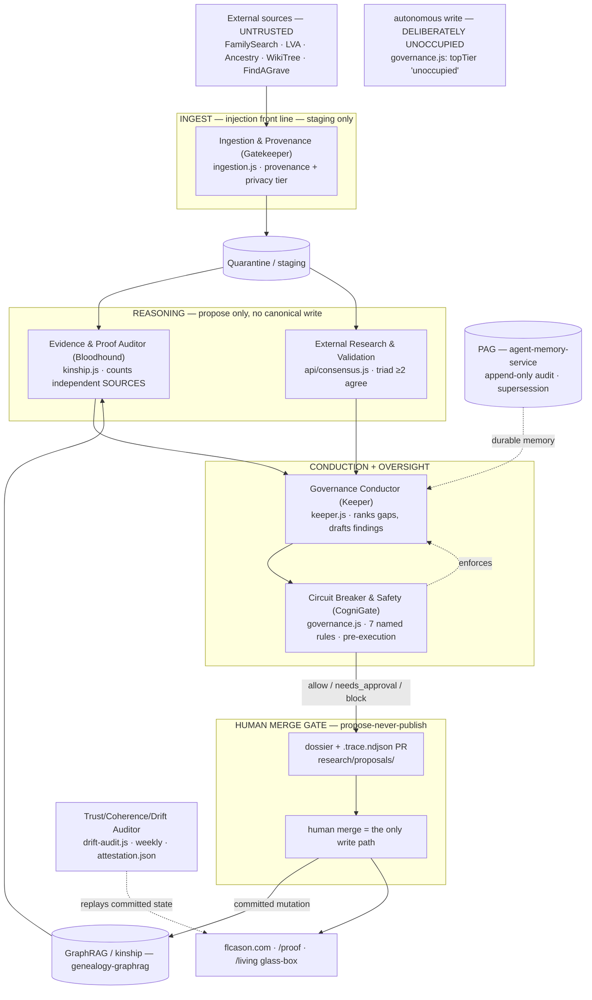

# Vorion-Governed Genealogy — Hardened Architecture & Public-Claim Ledger

*The reconciliation layer for flcason.com: it takes the proposed Vorion governance
vocabulary (BASIS · CogniGate · CAR ID · Paramesphere · PAG), grounds every claim in the
code that actually runs across the four repositories, closes five adversarial gaps using
the machinery that already exists, and re-grades what may be said in public. **No code
changes — this is a sign-off artifact.** Build only after the open decisions in §11 are
settled.*

This sits **above** the existing canon and does not replace it. Read first:
[`ORCHESTRATION.md`](./ORCHESTRATION.md) (the federation register), [`KEEPER.md`](./KEEPER.md)
(the conductor), [`bloodhound.md`](./bloodhound.md) (the one law), [`DRIFT.md`](./DRIFT.md)
(the self-audit). This document adds the one thing those don't: a bridge from the
Vorion-branded concepts to the live mechanisms, and an honest public-claim ledger.

---

## 0. The finding that reframes the brief

The brief reads as a greenfield design. **It is not greenfield.** Surveying the four
repositories on `claude/flcason-agent-orchestration-9adb4y`:

- **cason-heritage** runs a live 13-agent roster (`ui_kits/living-line/agents.js`,
  selftest-enforced), a typed pre-execution gate (`governance.js`, seven named rules),
  NDJSON traces, a `/proof` evidence-tier surface, a `/living` glass-box governance view,
  a weekly **drift-audit** (`scripts/drift-audit.js`) that emits a content-addressed
  `research/attestation.json`, a supersession ledger, and a **Keeper** (`scripts/keeper.js`)
  that runs propose-never-publish on a Monday cron.
- **governed-agents** is the canonical gate + NDJSON trace, and *already* runs a
  multi-model triad (Claude + Gemini + Grok) with a `require-model-consensus` rule.
- **agent-memory-service** is an append-only episodic + audit store with
  supersession-not-deletion — ~75% of a provenance substrate.
- **genealogy-graphrag** is a working hybrid retriever with kinship-graph resolution and
  citations (relational recall 0 → 1.0).

**None of `CAR ID / BASIS / CogniGate / Paramesphere / PAG / ATD` appear in any
repository.** The *substance* of the governance plane is built; the *branded vocabulary*
is not. So the highest-value hardening is not to build new components — it is to (a) map
the vocabulary onto the live mechanisms without renaming working code to sound novel, and
(b) re-grade the public claims accordingly. The brief's own truth-in-claims instinct (B5)
demands exactly this.

---

## 1. The reconciliation — Vorion vocabulary ↔ what already runs

This table is the centre of the document. Every proposed concept is bound to the live
mechanism that instantiates it, the file that proves it, and a recommendation.

| Vorion concept | Live mechanism (today) | Proof (repo · file) | Status | Recommendation |
|---|---|---|---|---|
| **CogniGate** (cross-tier enforcement) | `evaluatePolicy(action, rules)` → `allow / needs_approval / block` | governed-agents `lib/governance.ts`; cason-heritage `ui_kits/living-line/governance.js` (faithful port) | **Built** | Adopt "CogniGate" as the *cross-system label* for this gate. Do **not** rebuild. |
| **CAR ID** (scoped agent identity) | `agents.js` registry — each agent has a handle, modules, abilities, autonomy tier, governance hooks; `selftest:agents` enforces "a `live` agent must have a real module on disk" | cason-heritage `ui_kits/living-line/agents.js` | **Built (unsigned)** | The registry *is* CAR ID. Net-new = cryptographically signing the entry (identity → capability binding becomes tamper-evident). |
| **ATD** (Agent Trust Descriptor) | The `agents.js` registry entry itself: identity bound to autonomy tier + capability envelope + governance hooks | same as above | **Built (unsigned)** | ATD = a signed `agents.js` entry. Don't invent a new artifact; sign the one that exists. |
| **BASIS tiers** (T1–T7) | Autonomy tiers `advises / proposes / acts-bounded / cross-cutting`, with the **top tier (autonomous write) deliberately unoccupied** (`governance.js` `supervised()` → `topTier: 'unoccupied'`) | cason-heritage `agents.js`, `governance.js` | **Built (different scale)** | Map T-numbers onto the live tiers (§4). The empty T7 is *already codified* — keep it as the autonomy frontier. |
| **PAG** (provenance, replayable) | Append-only episodic + audit log + supersession-not-deletion (`agent-memory-service`); content-addressed `attestation.json` digest (cason drift-audit); per-run `.trace.ndjson` (Keeper) | agent-memory-service `src/agent_memory/`; cason `research/attestation.json`, `research/proposals/*.trace.ndjson` | **~75% built** | PAG = agent-memory-service + the trace + the attestation digest. Net-new = content-addressing on memory writes, signing, agent-identity on audit entries, replay snapshot (§7-5). |
| **Paramesphere** (model-identity attestation) | `attestation.json` = content-addressed digest + **per-persona behavioral fingerprints**, regression-checked weekly by drift-audit | cason `scripts/drift-audit.js`, `research/DRIFT.md`, `research/attestation.json` | **Behavioral attestation built; weight-space N/A** | This is the *behavioral* grade (B1). It is real and running. Weight-space `I(θ)` needs a self-hosted model the system does **not** yet have (§4, §7-6). |
| **Red Cell / oversight independence** | The **one law**: corroboration counts independent *sources*, not voices (`bloodhound.md`); `require-model-consensus` (≥2 of the triad) | cason `research/bloodhound.md`, `governance.js`; governed-agents `lib/consensus.ts` | **Built (source-level)** | Bloodhound already defeats "same blind spot" at the source level. Net-new = *attesting* the consenting models are distinct instances (§7-2). |

**The headline recommendation:** treat the Vorion terms as a **standard vocabulary layered
over working mechanisms**, never as a mandate to re-implement them under new names. That is
the only framing that survives B5.

---

## 2. Adversarial read — carried forward, plus what the survey changes

The brief's B1–B5 stand and are well-aimed; keep them verbatim. The survey adds three:

- **B6 — do not rebuild under new names.** The largest risk now is *vocabulary churn*:
  re-implementing `governance.js`/`agents.js`/`drift-audit.js` as "CogniGate"/"CAR ID"/"PAG"
  modules to match the brief. That destroys working, self-tested code and manufactures the
  exact gap between marketing and reality the system exists to refuse. Map, don't rename.
- **B7 — adopt the live roster, not the hypothetical one.** The brief's roster
  (Scout/Scribe/Correlator/Adjudicator/Publisher) does not exist; the live roster
  (Keeper/Bloodhound/Personas/Ingestion-Gatekeeper/Curator/Almanac/…) does, and is
  selftest-enforced. Demo copy and diagrams must use the live names or they describe
  fiction.
- **B8 — the GPS framing is absent in the code.** The brief leans on the Genealogical
  Proof Standard (esp. "GPS component 4"); the live system uses its **own** evidence tiers
  (`confirmed / secondary / leading / possible / unsolved / eliminated / disproven`) and the
  bloodhound law, and never references GPS. Decide in §11 whether to adopt GPS vocabulary or
  keep the tiers. **Until decided, express refusals in the live tier/law terms** — that is
  what this document does in §6.

---

## 3. Reconciled control structure (live agents, real gate)

Privacy is **not** a separate agent — it is the Gatekeeper's privacy tier plus the
persona temporal-horizon circuit breaker and the `/living` living-private exclusion. The
unoccupied top tier is the autonomy frontier the governance telemetry would one day
justify moving — the empty slot is the pitch, not a gap.

---

## 4. Trust & attestation model (grounded)

**Tier mapping (proposed — the code uses names, not T-numbers; adopt this in §11):**

| BASIS | Live autonomy tier | Live example |
|---|---|---|
| T1–T2 | `advises` / staging-only `proposes` | Almanac (advises); Ingestion/Gatekeeper (staging write only) |
| T3–T4 | `proposes` | Bloodhound, External Research/consensus — emit proposals, never write canonical |
| T5 | `acts-bounded` (oversight) | Drift Auditor, Circuit Breaker — act within a fixed envelope |
| T6 | `proposes` + **human merge** | Keeper — drafts the dossier; the human merge is the gate |
| **T7** | **unoccupied** | autonomous canonical write — `governance.js` refuses it by construction |

**The five-layer per-action check, reconciled:**

1. **CAR ID** — the acting agent resolves to an `agents.js` registry entry. *Built; sign it
   to make it tamper-evident.*
2. **ATD** — that entry's capability envelope (modules, abilities, autonomy tier). CogniGate
   checks the action falls inside it. *Built; the signed entry is the ATD.*
3. **BASIS tier** — required tier ≤ asserted tier. *Provable within-system* (your standard,
   your system); "industry standard" stays aspirational.
4. **Model-identity attestation — dual mode, two grades:**
   - *Behavioral (today, all agents):* `attestation.json` content-addressed digest +
     per-persona fingerprints, regression-checked weekly. Detects gross drift/swap on
     fingerprinted behaviors. **Strictly weaker than weight identity; for API agents you are
     ultimately trusting the provider's model routing — name that assumption (B-canary).**
   - *Weight-space (aspirational):* Paramesphere `I(θ)` requires a self-hosted open-weight
     model the system does not yet run. Qualified even then: same-model tamper/swap on a
     fixed weight set, **not** cross-model identity, **not** quantization-robust.
5. **PAG** — the admitted action is recorded append-only with inputs, attestation result,
   tier, and reasoning, replayable. *agent-memory-service + the NDJSON trace + the
   attestation digest; net-new crypto in §7-5.*

---

## 5. Hazard analysis (STPA) mapped to the **real** gate

Losses unchanged: L1 false conclusion published · L2 living-person privacy breach · L3
corrupted canonical record · L4 credibility loss · L5 governance bypass discredits the
demo. Hazards now map to the seven rules that actually run in `governance.js`:

| ID | Hazard | Live constraint that controls it (real rule) |
|---|---|---|
| H1 | Living-person PII surfaced | Gatekeeper privacy tier + persona temporal-horizon breaker + `/living` living-private exclusion |
| H2 | Claim promoted above its evidence | `no-overclaimed-record` — cannot assert `confirmed`/`secondary` without a primary doc ≥ threshold; tier caps otherwise |
| H3 | Disproven myth re-asserted | `no-quarantined-myth` — blocks any action repeating a quarantined claim |
| H3′ | Ruled-out ancestor revived | `no-eliminated-kin` — blocks reviving an `eliminated` kin line |
| H3″ | Correction silently reverted | `no-superseded-value` — blocks contradicting the supersession ledger |
| H4 | Silent model swap / echo | `require-model-consensus` (≥2 *independent sources*, per bloodhound) + weekly drift attestation |
| H5 | Injection via untrusted source | Ingest is data, not instructions; Gatekeeper staging-only write — injection cannot reach canonical |
| H6 | Unprovenanced claim | `require-provenance` — blocks any action citing no source |
| **H7** | **Post-commit drift** — a *standing* canonical assertion no longer supported by replayed evidence (retracted source, broken citation, later-weakened merge, agent later found compromised) | **Net-new invariant on existing machinery:** add to `drift-audit.js`'s invariant battery a check that replays PAG provenance for each standing claim against current evidence and opens a drift PR on divergence |

H7 is the only genuinely missing hazard, and its control is an *extension* of a system
that already runs weekly — not a new subsystem.

---

## 6. The money shot — Cason ↔ Causey, refused without DNA

Re-expressed through the **live gate and the bloodhound law**. Per the sign-off decision,
**no Y-DNA**: the refusal stands on evidence corroboration alone, so it is correct
regardless of any haplogroup contest.

1. **Ingestion/Gatekeeper** lands a Dorchester County, MD record naming a *John Causey*,
   c. 1670, in **quarantine** with provenance (staging-only write — H5 contained).
2. **Bloodhound (Evidence & Proof Auditor)** weighs a proposed merge of the Causey cluster
   into the Cason paternal line. The case for it is phonetic adjacency (Cason/Casson ↔
   Causey/Cossey) plus an overlapping VA→MD migration window — **one weak indirect strand**,
   not independent corroboration.
3. **External Research / consensus** returns three models "agreeing" the merge is
   plausible. **The one law fires:** three voices tracing to the same derivative trees are
   *one* source echoed thrice, not three confirmations — exactly the Thomas-1608-Digswell
   echo `bloodhound.md` already documents. `require-model-consensus` is satisfied on *count*
   but the source-independence test collapses the echo to a single weak strand.
4. **CogniGate (`governance.js`)** evaluates the merge action:
   - `no-overclaimed-record` → the merge would assert a `confirmed` paternal link on
     indirect evidence with no primary record → **caps the tier at `possible`** (a primary
     record outweighs any number of derivative trees — the corollary law).
   - `lead-needs-human-merge` → routes the (capped) finding to the human merge gate.
   - Decision: **not `allow`.** The canonical record is never mutated autonomously.
5. **Outcome:** the canonical line is uncorrupted. The Keeper writes a dossier +
   `.trace.ndjson` to `research/proposals/`; a human reviews. `/proof` can publish a
   "Cason vs. Causey" disambiguation marked **[possible as separate lines] / [unproven as
   merge]**, evidence cited. `/living` is unaffected (privacy untouched).

One vignette exercises CAR-ID-scoped agents, the live gate, the bloodhound independence
law, propose-never-publish human gating, and a replayable trace — and gets the genealogy
*right on evidence alone*. If a verified Y-DNA exclusion later exists, it becomes a
*strengthening* footnote, never the load-bearing beam.

---

## 7. The five hardening gaps — grounded (gap → live cover → net-new delta)

1. **Money-shot must be DNA-robust.** *Live cover:* the bloodhound law + `no-overclaimed-record`
   already refuse the merge on evidence. *Delta:* none — adopt §6 as the acceptance trace;
   drop the Haplo agent and the `ydna_haplogroup_conflict` gate from the brief (no such agent
   or rule exists, and DNA is out by decision). H3-as-DNA becomes H2/H3″ as written.
2. **Enforced oversight independence.** *Live cover:* bloodhound counts independent sources;
   `require-model-consensus` needs ≥2. *Delta:* CogniGate should refuse to honor a consensus
   when model-identity attestation shows the consenting agents resolved to the **same model
   instance** — bind the §4 fingerprints to the consensus check so "independent" is
   *attested*, not assumed.
3. **Canary / provider trust, named.** *Live cover:* weekly drift attestation. *Delta:*
   make the fingerprint/probe set **secret + rotated**, add distributional drift on real
   outputs (not only fixed challenges), and **state plainly in the ledger that for API
   agents the provider's model routing is a trust assumption, not a proof** — you cannot
   out-attest the provider.
4. **Post-commit drift (H7).** *Live cover:* `drift-audit.js` already runs weekly with an
   invariant battery + attestation + regression PR. *Delta:* add one invariant — replay PAG
   provenance for each standing claim vs. current evidence; open a drift PR on divergence.
   This *is* the reconciliation auditor (primitive #1).
5. **PAG substrate, pinned.** *Live cover:* agent-memory-service (append-only episodic +
   audit + supersession) + cason's content-addressed `attestation.json`. *Delta:* content-address
   memory writes (SHA-256 over content+metadata), sign audit entries, record `agent_id` +
   `model_id` + `attestation_level` per entry, and persist a replay snapshot so "why was this
   refused months later" is reconstructable. Until done, **"replayable provenance" is
   qualified, not provable** in the ledger.

---

## 8. The three primitives → where they land in the live system

| Primitive (proven in `governed-trader`) | Lands as | Live module to extend |
|---|---|---|
| Reconciliation drift auditor | H7 standing-claim invariant | `scripts/drift-audit.js` (DRIFT.md) |
| Human-approval glass-box | the held-action view with the full attestation stack | `/living` glass-box + `lead-needs-human-merge` + Keeper PR |
| Attested multi-model consensus | fingerprint-attested distinct instances | `api/consensus.js` + `governance.js require-model-consensus` + `bloodhound.md` |

All three already have working seeds; each is an *extension*, not a build.

---

## 9. Public-claim ledger — re-graded against the code

The brief's ledger under-counts what is built. Honest re-grade:

| Claim | Brief said | Re-graded | Basis |
|---|---|---|---|
| CogniGate hard-gates actions | buildable | **Provable / running** | `governance.js` + `keeper.js`, selftested |
| CAR ID = scoped checkable identity | buildable | **Built (unsigned)** | `agents.js` registry + `selftest:agents` |
| Tier-gated capability, self-consistent | provable within-system | **Built** | autonomy tiers + unoccupied top tier in code |
| Multi-model consensus catches swap/echo | qualified | **Built (source-level), qualified on adaptive evasion** | `bloodhound.md`, `consensus.ts`, `require-model-consensus` |
| Replayable provenance (PAG) | implied | **Qualified** until content-addressing/signing/snapshot land | agent-memory-service + attestation.json |
| Behavioral model attestation | (API fallback) | **Built, qualified** | `attestation.json` fingerprints, weekly drift |
| Paramesphere `I(θ)` weight-space | qualified | **Not yet applicable** — no self-hosted model exists | survey: no self-hosted weights in any repo |
| BASIS as *industry* standard | aspirational | **Aspirational** | no external adoption |
| "Fully autonomous" | reframe | **Supervised-autonomous** | human merge is the only write path; T7 unoccupied |
| Telemetry could justify removing the human (T7) | aspirational | **Aspirational (roadmap thesis)** | unchanged |

---

## 10. Build staging (federation-seam first — aligns with the live crons/CI)

Most agents exist; the gap is the seam (ORCHESTRATION.md §0). Staging reflects that:

- **Stage 0 — wire the seam.** Point `memory-client.js` at the real agent-memory-service
  (`KEEPER_MEMORY_URL`); point consensus/kinship at the real services instead of in-browser
  ports. *Benchmark:* a Keeper run reads/writes durable memory and one shared trace.
- **Stage 1 — attest independence.** Bind §4 fingerprints to `require-model-consensus`;
  refuse same-instance consensus. *Benchmark:* a forced same-model "consensus" is rejected.
- **Stage 2 — reconciliation invariant (H7).** Add the standing-claim replay check to
  `drift-audit.js`. *Benchmark:* a retracted source trips a drift PR.
- **Stage 3 — PAG crypto.** Content-address + sign memory/audit writes; record agent/model
  identity; persist a replay snapshot. *Benchmark:* a months-later refusal is reconstructable
  byte-for-byte.
- **Stage 4 — public-claim honesty pass.** `/proof` confidence labels never exceed the
  ledger; `/living` privacy enforced; demo copy uses live names (B7) and the ledger's
  grades (§9). *Benchmark:* no public claim outruns §9.

A self-hosted open-weight agent (for a real Paramesphere target) is **out of scope for
sign-off** and a separate decision — note it, don't assume it.

---

## 11. Open decisions for sign-off

1. **Vocabulary:** adopt the Vorion terms as labels over the live mechanisms (recommended,
   §1) — or keep home-grown names only? This governs all demo copy.
2. **GPS framing (B8):** adopt Genealogical Proof Standard vocabulary, or keep the live
   evidence tiers + bloodhound law? (§6 uses the live terms pending this.)
3. **Tier mapping (§4):** accept the proposed BASIS↔autonomy-tier table, or refine?
4. **Red Cell:** introduce a distinct adversarial agent, or treat Bloodhound's
   source-independence law as the oversight (recommended — it already runs)?
5. **PAG naming/ownership:** confirm agent-memory-service as the PAG substrate and the §7-5
   crypto deltas as the definition of "done."
6. **Self-hosted model:** in or out of the roadmap for a real (weight-space) Paramesphere
   target?

---

## Caveats

- **Decision applied:** no Y-DNA in the money shot; the refusal stands on evidence
  corroboration alone (§6). The brief's Haplo agent and `ydna_haplogroup_conflict` gate are
  dropped — no such agent or rule exists, and reality uses evidence tiers, not GPS/DNA.
- **ATD and PAG remain inferred expansions** (Agent Trust Descriptor; Provenance
  Attestation Graph). This document binds them to `agents.js` and agent-memory-service
  respectively; confirm in §11 before they harden into spec.
- **Federation seams are documented but not yet live-wired** (ORCHESTRATION.md): the site
  runs self-contained faithful ports of the three sibling layers. Stage 0 closes this.
- **Behavioral ≠ weight-space attestation.** `attestation.json` fingerprints are behavioral
  and content-addressed, regression-checked weekly — real, and strictly weaker than weight
  identity. Weight-space `I(θ)` has no target until a self-hosted model exists.
- Cost/latency claims remain structural, not measured — the async/batch shape keeps
  enforcement off the critical path, but real token volumes are still needed to quantify.
